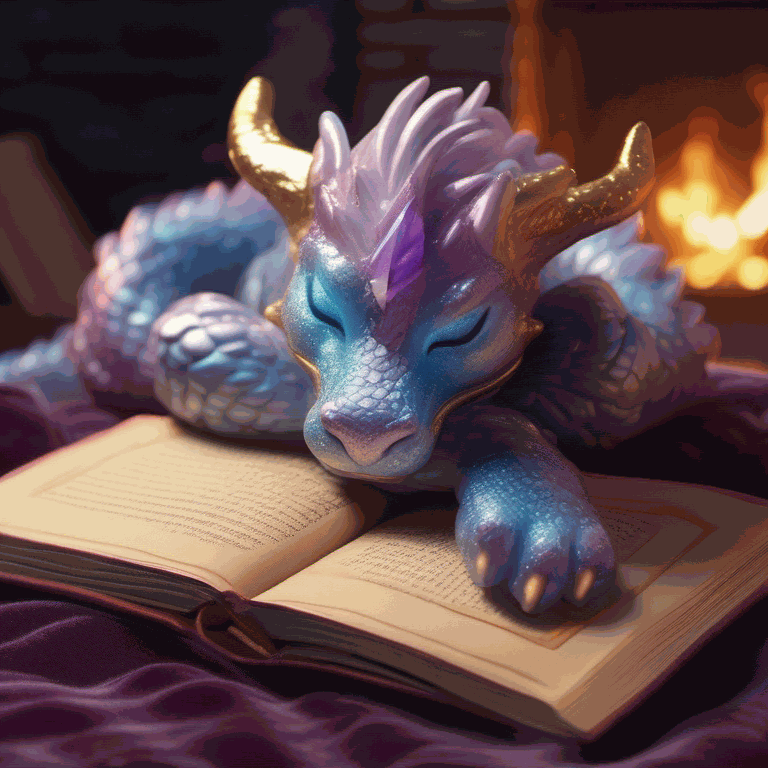

# GIF Animation Generator (LangGraph + SDXL + ComfyUI)

This project generates an animated GIF from a single text prompt using LangGraph for reasoning, OpenRouter for free LLMs, and ComfyUI + SDXL for local image generation.  

It is built as a fully free alternative to using OpenAI GPT-4o + DALL·E 3.

---

## What This Project Does

From a single text prompt, the system automatically generates:

- A detailed character description  
- A 5-step animation storyline  
- Five SDXL image prompts  
- Five SDXL images (via ComfyUI)  
- A final animated GIF  

---

## Why This Project Exists

Normally, the easiest method to generate consistent animated frames is: 

OpenAI GPT-4o → DALL·E 3 → GIF export

But DALL·E 3 requires an OpenAI paid subscription.

Because this project avoids any paid services, it uses a **completely free** pipeline:

- **OpenRouter** (free-tier LLMs)
- **ComfyUI** (fully free + local image generation)
- **SDXL** (high-quality open-source model)
- **LangGraph** (orchestration & reasoning)

This achieves consistent multi-frame generation with **zero cost** and **full local control**.

---

## Example Output

**Prompt used:** : A small cute baby dragon sitting by a fireplace reading a book, warm cozy lighting, magical floating sparks.

**Generated GIF:**

---

## Project Structure

gif_animation_generator_langgraph/
│
├─ src/
│ ├─ graph_nodes.py
│ ├─ graph_state.py
│ ├─ graph_workflow.py
│ ├─ image_utils.py
│ ├─ runner.py
│ └─ init.py
│
├─ ComfyUI/ # Local installation (ignored in Git)
│
├─ main.py
├─ .env
├─ .gitignore
├─ requirements.txt
└─ README.md

---

## Installation

### 1. Clone the repository

git clone https://github.com/roxtj/Artificial-Intelligence.git
cd gif_animation_generator_langgraph

### 2. Create a virtual environment
python -m venv .venv-gifgen
.\.venv-gifgen\Scripts\activate

### 3. Install dependencies
pip install -r requirements.txt

### Configure Environment Variables
Create a .env file in the project root:

OPENROUTER_API_KEY=your_key_here

If the key is missing, the system automatically falls back to Ollama (local LLM).

## ComfyUI Setup
### 1. Download ComfyUI
Download and place it inside the project:

gif_animation_generator_langgraph/
└── ComfyUI/

Repository link:
https://github.com/comfyanonymous/ComfyUI

### 2. Download Required SDXL Models - Huggingface
Place these files under:

ComfyUI/models/checkpoints/

Required files:

sd_xl_base_1.0.safetensors
sd_xl_base_1.0_0.9vae.safetensors
sd_xl_refiner_1.0.safetensors
sd_xl_refiner_1.0_0.9vae.safetensors

### 3. Add the Workflow File
Place the workflow here:

ComfyUI/workflows/workflow_api.json

### 4. Start ComfyUI
1. cd ComfyUI
2. python main.py

ComfyUI must stay running while generating GIFs.

## Running the Generator

1. Run the generator script:
python main.py

2. You will be prompted:
Enter your animation description:

3. The final GIF will be saved as:
output.gif

## Notes
* The project automatically switches between OpenRouter and Ollama based on availability.
* All image generation happens entirely locally via ComfyUI.
* No paid services are required.